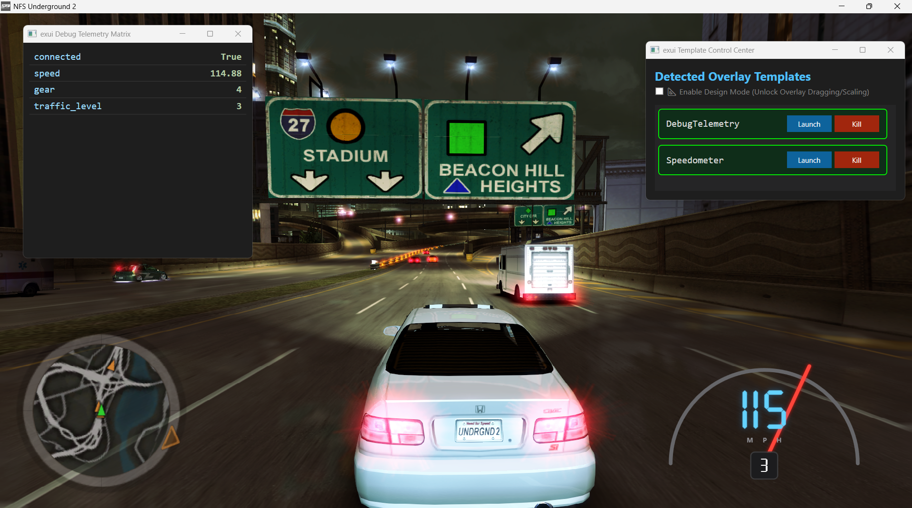

# exui-wpf
frontend receiver of exui-api

**under progress. not ready for casual usage. Proof of Concept**
## What
**Goal**: to create new ui elements to nfsu2 with ease.

**Method**: transparent native os windows to mimic in game ui

**Advantages**: very easy to create, customize and switch templates. takes 5-10 minutes to create a new gui element depending on the complexity and wpf skills.

**Backend**: receive telemetry data from a websocket via [exui-api](https://github.com/clod44/exui-api)



## Templates
- the `templates` folder contains the ui elements you can use.  
- the `Main` template is special and like a simple parent to the others.
- you can copy the `Speedometer` template, change the names and change the `.xaml` file to create a new template. you have all the reach of a `.wpf` file and a constructor `.cs` file which you can expand from. 
- for practice, keep your template content contained within your template folder.
## Telemetry data
### .wpf
```xml 
<TextBlock Text="{Binding Telemetry[speed], StringFormat={}{0:000}}" ...
```
the "speed" keyword here is in the incoming websocket data. see backend configuration: [exui-api variables.txt](https://github.com/clod44/exui-api/blob/main/variables.txt)


get all data: 
```xml
<ItemsControl ItemsSource="{Binding Telemetry.Entries}">
```

### .cs
Read once:
```cs
if (this.DataContext is MainState state)
    {
        float currentSpeed = (float)state.Telemetry["speed"];
        ...
    }
```

Read continuously:
```cs
    public Speedometer()
    {
        InitializeComponent();

        // 1. Wait until WPF successfully attaches the DataContext to this window
        this.DataContextChanged += (sender, args) =>
        {
            if (this.DataContext is MainState state)
            {
                state.Telemetry.PropertyChanged += OnTelemetryTick;
            }
        };
    }


    private void OnTelemetryTick(object? sender, System.ComponentModel.PropertyChangedEventArgs e)
    {
        // speed change only
        if (e.PropertyName == "speed" && this.DataContext is MainState state)
        {
            float speed = (float)state.Telemetry["speed"];
        }
    }
}
```

<hr>

**fork/commit encouraged**